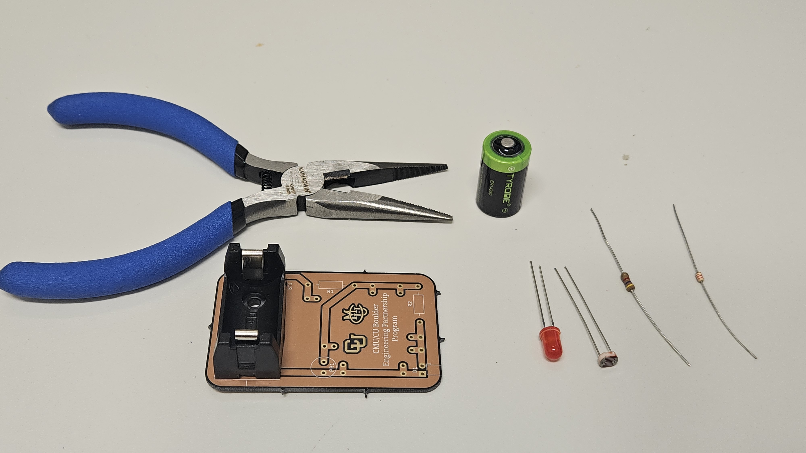
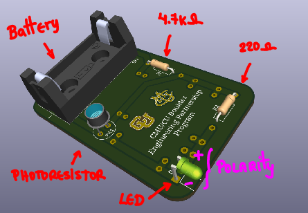
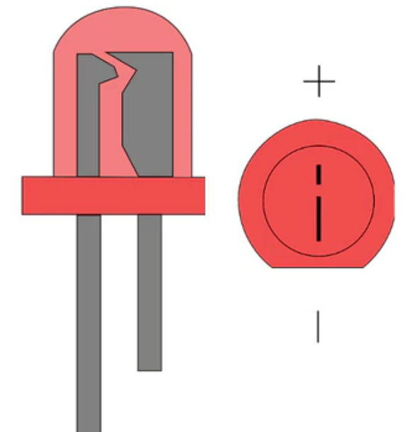

# LED Night Light — Educational Project

The **LED Night Light** is a compact, energy-efficient device that automatically turns on in darkness and turns off under bright ambient light using a **photoresistor (LDR)** in a voltage-divider circuit. This project introduces students to fundamental electronics concepts such as current-limiting resistors, voltage dividers, photoresistor behavior, and sensor-based control. It is designed for hands-on learning within the CU Boulder / CMU Partnership Program.

---

## Breadboard Prototype

The circuit is first built on a **breadboard** for testing, experimentation, and debugging. Using basic components—resistors, an LED, a photoresistor, a battery, and jumper wires—students can verify their wiring and observe how the LED responds as light levels change.

  

<em>Figure 1: Breadboard setup of the LED Night Light.</em>

---

## PCB Implementation

Once the prototype is validated, the design can be transferred to a **PCB (Printed Circuit Board)** for a more permanent and reliable build. The PCB is designed for **tool-free assembly**: students simply insert and bend component leads into the pre-defined holes (no soldering required). This reinforces skills such as reading PCB silkscreens, identifying components, and performing clean mechanical assembly.

  

<em>Figure 2: Assembled PCB version of the Battery-Powered LED Night Light.</em>

---

## Educational Goals

This project reinforces foundational concepts, including:

- Operation of LEDs and basic semiconductor behavior
- Light-dependent resistors (LDRs) as analog sensors
- Voltage dividers and threshold-based activation
- Power and energy considerations in low-power circuits
- PCB layout interpretation and hands-on component placement

The end result is a functional night light that demonstrates the interaction between sensing and simple electronic control.

---

# Quick Start

## Components

To build the Battery-Powered LED Night Light, you will need:

- **1 × LED**
- **1 × Photoresistor (LDR)**
- **1 × 4.7 kΩ resistor** (for the voltage divider)
- **1 × 220 Ω resistor** (LED current-limiting)
- **1 × 1/2 AA Size LS Battery (ER14250)**
- **1 × LED Night Light PCB**

  

<em>Figure 3: Components for the Battery-Powered LED Night Light.</em>

### Resistor Identification

  

<em>Figure 4: Resistor color-coding reference.</em>

---

## Assembly

Insert each component into its corresponding location on the PCB as indicated below. Ensure proper orientation for polarity-sensitive parts.

  

<em>Figure 5: PCB component placement guide.</em>

### LED Polarity

LEDs must be oriented correctly to function. The **long leg (anode)** is positive, and the **flat side** marks the negative lead (cathode).

  

<em>Figure 6: LED polarity reference.</em>

---

# License

This project is released under the **MIT License**.

---

# Disclaimer & Safety Notice

This activity is intended for **educational use only**, supporting hands-on learning in basic electronics. Follow all assembly instructions carefully and handle components and tools responsibly. The pliers used for bending component leads may have sharp edges—use them with caution.

This device is **not a toy** and must be used only in safe, supervised environments. Keep all components away from heat sources, moisture, and small children. The author and the CU Boulder / CMU Partnership Program are **not responsible for injury, damage, or malfunction** resulting from misuse or improper handling of the materials.

While creativity and experimentation are encouraged, **safety is the top priority**. Always verify circuit connections before inserting the battery, and avoid touching conductive parts while the device is powered. Any modifications to the original design should be performed under supervision or after consulting an instructor.

For additional protection, it is recommended that users wear **safety glasses** during assembly to prevent injury caused by component leads or tool slips. Please note that safety glasses are **not provided** as part of this activity.

By participating, users acknowledge that they are responsible for their own safety and agree to use the materials only for instructional, non-commercial purposes.

