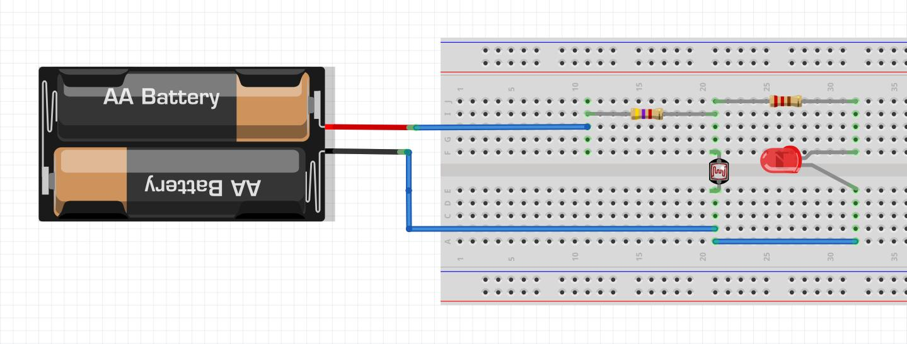
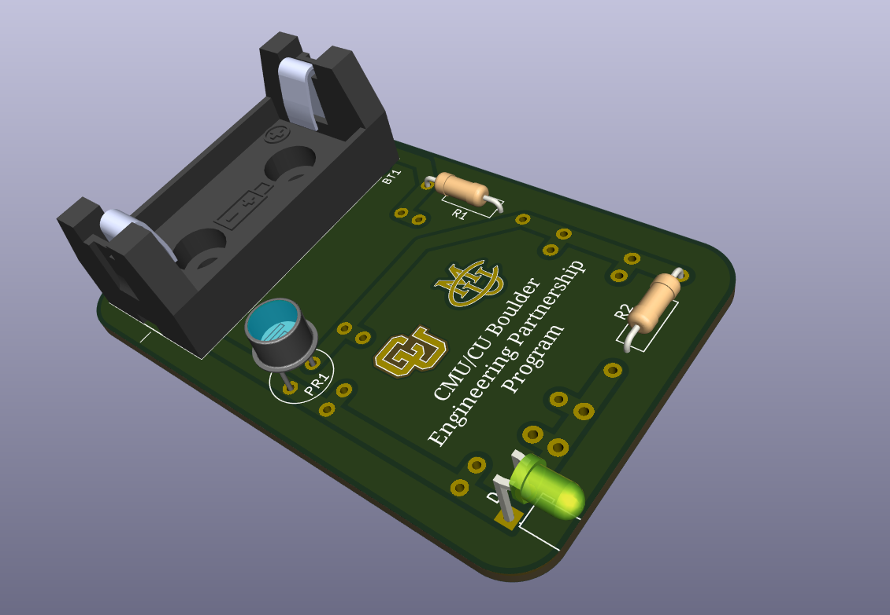

# LED Night Light - Educational Project

The **LED Night Light** is a compact, energy-efficient device that provides gentle illumination at night. It automatically turns on in darkness and off in bright conditions using a **photoresistor (LDR)** in a voltage divider circuit. This project demonstrates basic electronics concepts such as current-limiting resistors, voltage dividers, and sensor-based control, connecting theory with hands-on practice for students in the CU Boulder / CMU Partnership Program.

The circuit can be first assembled on a **breadboard** for prototyping and testing. Components include resistors, LEDs, a photoresistor, a battery, and jumper wires. This allows students to verify connections and observe LED behavior under different lighting conditions.

  
*Breadboard setup of the LED Night Light.*

After testing, the design can be transferred to a **PCB (printed circuit board)** for a permanent, reliable solution. Students assemble the PCB without soldering, bending component leads into pre-designed holes, learning PCB layout, component placement, and practical assembly skills.

  
*Assembled PCB version of the Battery-Powered LED Night Light.*

This project provides a hands-on experience that reinforces concepts in semiconductors, sensors, energy conversion, and circuit fundamentals while resulting in a functional, real-world device.
